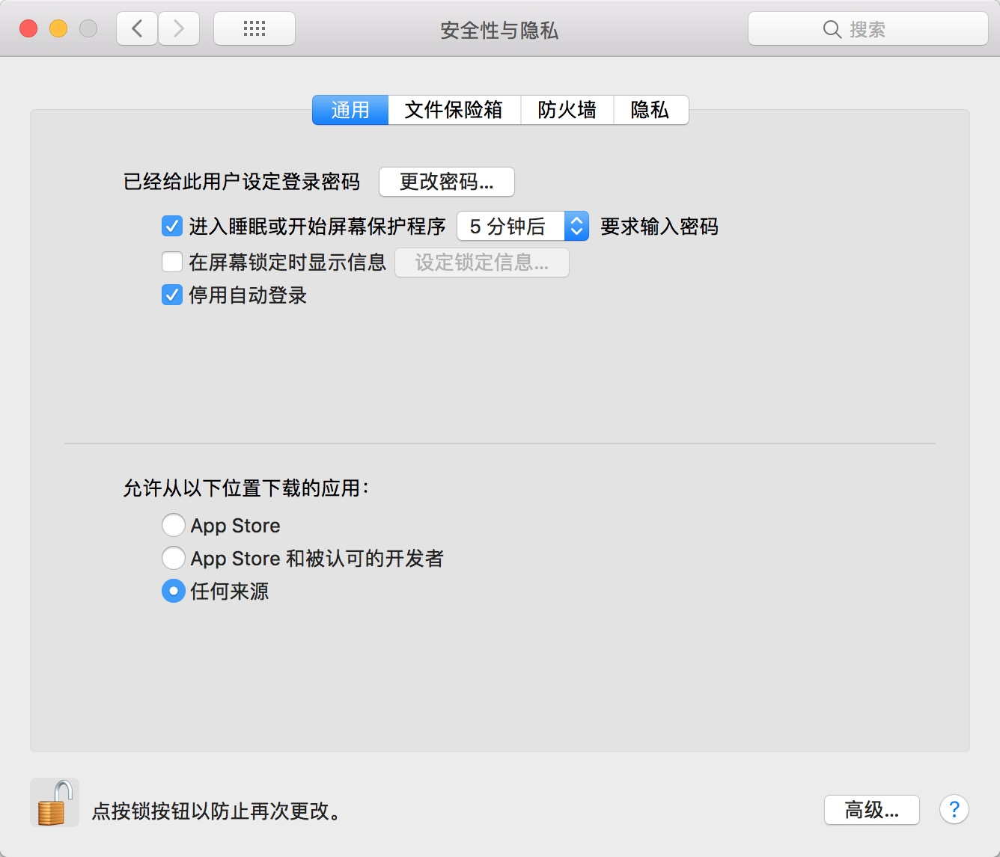
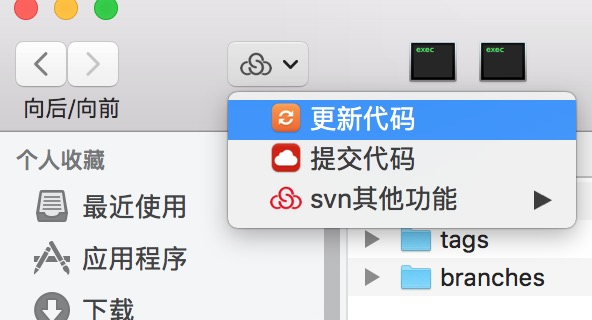

# svn插件用于MacOS 10.10+以上系统(理论上系统要求性不高, 没测试)

对系统性能不会产生任何影响, 属于被动监听
也没有任何其他功能, 也不会产生垃圾文件, 属于非常健康的App

喜欢的话, 给我点个 ✨ star, 谢谢了

---------------------------------------------------
## 1、此插件为后台进程, 切勿关闭, 关闭后插件无法正常使用
## 2、插件若不显示, 点击菜单重启Finder
## 3、如有任何BUG, 请联系xujun2018@qq.com

---------------------------------------------------

### 动态效果演示

### 因为没钱买证书签名  所以要手动授权下 或者关闭下 sudo spctl --master-disable

### 设置菜单插件

### 效果演示

